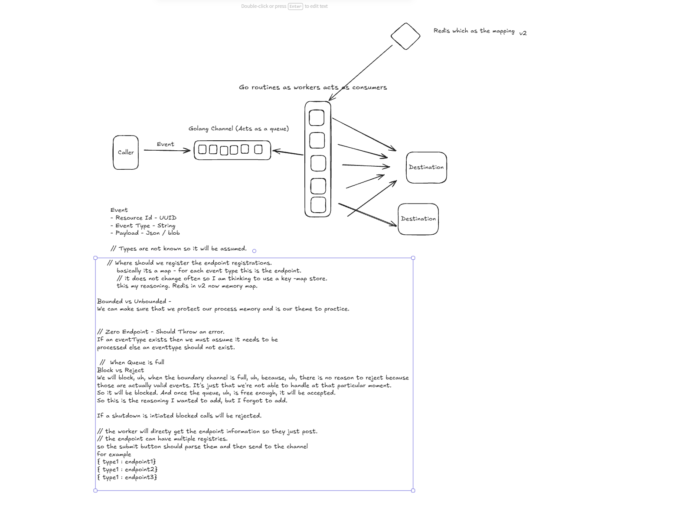

### Understanding
So if my understanding is correct, we have a production scheduling SaaS, uh, which schedules a different kind of, uh, productions and does all the different kinds of, uh, details or processing for the production. Um, this data needs to be sent to the ERP or the dashboard, which is basically on the client side or the customer side. Now the problem is when sub scheduling event happens, uh, what are the ways that we can, uh, send this data? Or how how can the the two systems communicate. There are two systems. There are two architectures or two philosophies, which is one is one is pull, which is, like, a HTTP request where the client requests and pulls the required response from the server. This is what a traditional approach would be. The other one is push where the client does not request. The client just keeps, you know, doing whatever it is doing. The server, when the event happens on the server side, it will automatically push the relevant response to the subscribed client. Is this correct? is... and the webhook is basically the second thing that I explained. It's just a program which waits for certain events to happen. And when certain events happen, it will push to the customers who are waiting for those events. Is this is this right?

### Refinements
- Pull (polling): client repeatedly asks the server "anything new?" Correct as you said.

- Push (webhooks): correct in spirit, but one detail — it's not literally the server reaching into the client's memory. The server makes a normal outbound HTTP POST to a URL the client gave it in advance. The client's side just needs a small HTTP server listening on that URL to receive it. So "push" here just means who initiates the HTTP request is inverted — server-initiated instead of client-initiated. Both directions are still plain HTTP.

- So the full chain: scheduling engine does its work → emits an internal event → webhook service picks it up → looks up registered endpoints for that customer/event type → delivers via HTTP POST to each. Issues #1-#5 in this project are entirely about that last stage — the delivery mechanics (queuing, worker pool, ordering, shutdown, failure visibility) — not the scheduling engine itself, which is assumed to already exist and just hand off events. 
    - So if the server initiates that CTP post to a predefined URL given by the client, what does... how does the client get the data? like, the HTTP server keeps listening. And when a post happens, what will happen? We'll give the data to client.
        - The client (Customer B) runs their own small HTTP server, always running, listening on that URL (e.g. https://customer-b.com/hooks/schedule-events). It sits idle, doing nothing, until a request arrives.

        - When our webhook service sends the POST, it's a normal HTTP request — headers, and a body containing the event data (JSON, typically something like {"event": "work_order.status_changed", "work_order_id": 123, "new_status": "delayed"}). That request travels over the internet and hits the client's listening server.


## Important - v1 does not external queues for storing the events it will only use golang.

- But v2 in the future will definitely use kafka.


## Issue #1 design — full record

Full decision log (initial proposal → issue found → final call) for every open
question on issue #1: `docs/adr/0001-accept-and-route-event.md`.

Architecture sketch (v1, with the Redis path marked as v2):



### Go entry point — `main` and how it relates to the binary
So for all of the go projects, do we have main as the main entry point? And what do you mean by the main entry point? Like, uh, what... how does it relate to the binary? Can you explain that, you know, the intuition behind this, please?

- Yes — every runnable Go program needs exactly one `func main()`, and it's tied directly to how the compiler produces a binary.

**The mechanism:**
- `package main` is a special, reserved package name. It tells the Go compiler "this directory produces an executable," not a library.
- Inside a `package main`, Go requires exactly one function called `main()` with no parameters, no return value. That's not a convention you could rename — the compiler specifically looks for it.
- When you run `go build`, the compiler finds that `package main` + `func main()` pair and produces a single standalone binary file (e.g. `webhook-go.exe`). Everything the program needs — your code, every package you imported, the Go runtime itself — gets statically compiled into that one file. No separate runtime needs to be installed on the machine that runs it (unlike Python needing a Python interpreter present).
- When you actually run that binary, the OS loads it and Go's runtime does its own startup (sets up the goroutine scheduler, memory allocator, etc.), then calls your `main()` function. Your code starts executing at the first line inside `main()`. When `main()` returns, the process exits.

**Not every Go project has one.** Only things meant to be *run* need `package main`. A library — code meant to be *imported* by other Go programs, like a JSON-parsing package — is just `package registry` or `package event` with exported functions; nobody calls `go run` on it directly, other code imports it and calls its functions. `go build` on a non-main package just compiles and caches it, it doesn't produce a runnable file.

**For this project:** since `webhook-go` is a runnable service (not a library), it needs exactly one `main()` — that's `cmd/main.go`. Everything else (`internal/registry`, `internal/event`, etc.) will be ordinary packages with no `main()` — `cmd/main.go`'s job is to import all of them, wire them together (build the registry, start the worker pool goroutines, start listening for shutdown), and that's it. It's the one place in the whole codebase where the program actually "starts."

### Why pointer receivers / pointer fields, not values
I dont know why we have to use pointer can you clear that point

Two related but separate things — a walkthrough with a concrete timeline.

**Why `Seed`/`Lookup` need pointer receivers on `Registry`:** a method with a *value* receiver operates on a **copy** of the struct — any change made inside the method disappears the moment it returns, because the original variable outside was never touched. If `Seed` were `func (r Registry) Seed(...)`, then `r.endpoints = endpoints` would set the field on a temporary copy that gets thrown away — the real `Registry` the caller holds would never actually get seeded. A pointer receiver (`func (r *Registry) Seed(...)`) means the method reaches the *original* struct via its memory address, so the mutation sticks.

**Why `IntakeService` needs to hold a `*Registry`, not a `Registry` value — this is the separate question.** Think of a `Registry` value as a photocopy of a document, and a `*Registry` as the actual address of the one real document. Concrete timeline:

```
r := registry.Registry{}          // one real Registry exists, empty
svc := intake.New(r)              // if New takes a VALUE — svc now holds its own
                                   // independent COPY of r, taken at this exact moment
r.Seed(map[...]{...})             // mutates the ORIGINAL r — svc's copy never sees this
svc.Submit(event)                 // looks up svc's copy — still empty, wrong result
```

If `New` instead takes `*registry.Registry`, `svc` doesn't hold a copy — it holds the *address* of the same real `Registry` that `r` refers to. There's only ever one `Registry` in memory; `r` and `svc.register` are just two different ways of pointing at it. So no matter what order `Seed()` and `New()` happen in, `svc` always sees the current, real state — because it's not looking at a snapshot, it's looking at the live thing.

That's why: value = independent copy, frozen at copy time. Pointer = shared reference to one real instance, always current.

## Next steps (paused here — resume from this list)

State as of pause (2026-08-29): issue #1 is functionally done — `Event`, `Registry`,
`DeliveryItem`, `IntakeService` (`New` + `Submit`) all written, and
`internal/intake/service_test.go` has two passing tests (happy-path fan-out count,
zero-endpoint error). Whole project builds, vets, and tests clean. Not yet committed.
Two small cleanup items still open (non-blocking): `event event.Event` param in
`Submit` shadows the `event` package; `ErrNoEndPoints` → idiomatic casing is
`ErrNoEndpoints`. `main.go`'s hardcoded test-data wiring is superseded by the real
tests — decide whether to trim it down.

**Working method update:** TDD (red-green) adopted going forward for new logic —
write the failing test first, then the minimal code to pass it. Recorded in
`CLAUDE.md`. Doesn't apply retroactively to #1's already-working code.

**Issue #2 design closed** — full record in `docs/adr/0002-bounded-worker-pool.md`.
Pool size via constructor param, 2s HTTP timeout (named constant), per-item panic
recovery, no failure-logging hook (that's #5's job), shutdown explicitly deferred to
#4. Now in TDD implementation (red-green) for issue #2.

**Issue #2 is done (2026-08-29).** Everything in the ADR built and verified:
`WorkerClient` (2s timeout, `SendDeliveryItem`, response body closed on success),
`Pool` (`NewPool`/`Start()`, N goroutines consuming `IntakeService.Queue()`), per-item
panic recovery (scoped correctly — see mistakes log, this one was genuinely subtle),
and `main.go` wired end to end (`select{}` looked right but deadlocks in a one-shot
program with no ongoing work — used a bounded `time.Sleep` instead, which is fine here
specifically since nothing concurrent is actually being synchronized with). Full test
suite passes, ran the actual binary to confirm it doesn't crash. `Pool.wg` was
introduced then removed — turned out to be premature infra for issue #4, not needed by
#2's own scope. All committed.

**Next: issue #3 (per-resource ordering, keyed mutex)** — start the same way #1 and #2
did: §1-2 pass, then the design round, write `docs/adr/0003-...md`, then TDD it.

## Article
- https://dev.to/vikthurrdev/designing-a-webhook-service-a-practical-guide-to-event-driven-architecture-3lep

- https://medium.com/@shivanimutke2501/day-50-system-design-concept-web-hooks-14615bd717a3